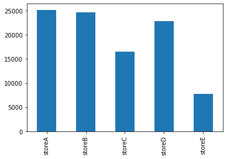
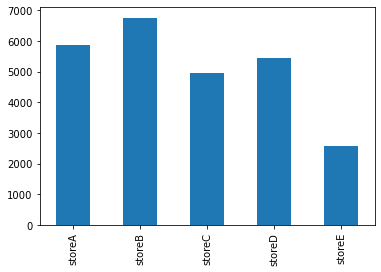
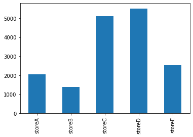
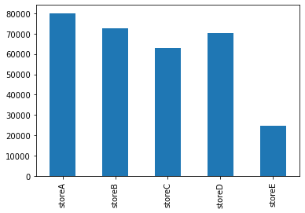

# Exercise: Drawing Conclusion

Data: store_data.csv (Weekly sales of different grocery stores)

Questions:
1. Which store has the highest total sales for the final month of data?
2. Which store makes the most sales on average?
3. Which store sells the most during the week of March 13th, 2016?
4. In what week does store C make its worst sales?
5. Which store has the most sales in the latest 3-month period?

## Reading in csv data file


```python
import pandas as pd
df = pd.read_csv('store_data.csv')
df.tail()
```


<div>
<style scoped>
    .dataframe tbody tr th:only-of-type {
        vertical-align: middle;
    }

    .dataframe tbody tr th {
        vertical-align: top;
    }

    .dataframe thead th {
        text-align: right;
    }
</style>
<table border="1" class="dataframe">
  <thead>
    <tr style="text-align: right;">
      <th></th>
      <th>week</th>
      <th>storeA</th>
      <th>storeB</th>
      <th>storeC</th>
      <th>storeD</th>
      <th>storeE</th>
    </tr>
  </thead>
  <tbody>
    <tr>
      <th>195</th>
      <td>2018-01-28</td>
      <td>282</td>
      <td>6351</td>
      <td>7759</td>
      <td>5558</td>
      <td>1028</td>
    </tr>
    <tr>
      <th>196</th>
      <td>2018-02-04</td>
      <td>4853</td>
      <td>6503</td>
      <td>4187</td>
      <td>5956</td>
      <td>1458</td>
    </tr>
    <tr>
      <th>197</th>
      <td>2018-02-11</td>
      <td>9202</td>
      <td>3677</td>
      <td>4540</td>
      <td>6186</td>
      <td>243</td>
    </tr>
    <tr>
      <th>198</th>
      <td>2018-02-18</td>
      <td>3512</td>
      <td>7511</td>
      <td>4151</td>
      <td>5596</td>
      <td>3501</td>
    </tr>
    <tr>
      <th>199</th>
      <td>2018-02-25</td>
      <td>7560</td>
      <td>6904</td>
      <td>3569</td>
      <td>5045</td>
      <td>2585</td>
    </tr>
  </tbody>
</table>
</div>


## Check column datatypes


```python
df.info()
```

    <class 'pandas.core.frame.DataFrame'>
    RangeIndex: 200 entries, 0 to 199
    Data columns (total 6 columns):
     #   Column  Non-Null Count  Dtype 
    ---  ------  --------------  ----- 
     0   week    200 non-null    object
     1   storeA  200 non-null    int64 
     2   storeB  200 non-null    int64 
     3   storeC  200 non-null    int64 
     4   storeD  200 non-null    int64 
     5   storeE  200 non-null    int64 
    dtypes: int64(5), object(1)
    memory usage: 9.5+ KB
    

## Q1: Which store has the highest total sales for the final month of data?


```python
df.tail(5)
```


<div>
<style scoped>
    .dataframe tbody tr th:only-of-type {
        vertical-align: middle;
    }

    .dataframe tbody tr th {
        vertical-align: top;
    }

    .dataframe thead th {
        text-align: right;
    }
</style>
<table border="1" class="dataframe">
  <thead>
    <tr style="text-align: right;">
      <th></th>
      <th>week</th>
      <th>storeA</th>
      <th>storeB</th>
      <th>storeC</th>
      <th>storeD</th>
      <th>storeE</th>
    </tr>
  </thead>
  <tbody>
    <tr>
      <th>195</th>
      <td>2018-01-28</td>
      <td>282</td>
      <td>6351</td>
      <td>7759</td>
      <td>5558</td>
      <td>1028</td>
    </tr>
    <tr>
      <th>196</th>
      <td>2018-02-04</td>
      <td>4853</td>
      <td>6503</td>
      <td>4187</td>
      <td>5956</td>
      <td>1458</td>
    </tr>
    <tr>
      <th>197</th>
      <td>2018-02-11</td>
      <td>9202</td>
      <td>3677</td>
      <td>4540</td>
      <td>6186</td>
      <td>243</td>
    </tr>
    <tr>
      <th>198</th>
      <td>2018-02-18</td>
      <td>3512</td>
      <td>7511</td>
      <td>4151</td>
      <td>5596</td>
      <td>3501</td>
    </tr>
    <tr>
      <th>199</th>
      <td>2018-02-25</td>
      <td>7560</td>
      <td>6904</td>
      <td>3569</td>
      <td>5045</td>
      <td>2585</td>
    </tr>
  </tbody>
</table>
</div>


```python
last_month = df.iloc[196: , 1:].sum()
type(last_month)
```


    pandas.core.series.Series


```python
last_month
```


    storeA    25127
    storeB    24595
    storeC    16447
    storeD    22783
    storeE     7787
    dtype: int64


```python
last_month.plot(kind='bar');
```


    

    


## Q2: Which store makes the most sales on average?


```python
avgs = df.iloc[:,1:].mean(axis=0)
avgs
```


    storeA    5865.480
    storeB    6756.710
    storeC    4942.105
    storeD    5431.405
    storeE    2580.025
    dtype: float64


```python
avgs.plot(kind='bar')
```


    <AxesSubplot:>


    

    


## Q3. Which store sells the most during the week of March 13th, 2016?


```python
wks = df.week
wks.head(3)
```


    0   2014-05-04
    1   2014-05-11
    2   2014-05-18
    Name: week, dtype: datetime64[ns]


```python
type(wks[0])
```


    pandas._libs.tslibs.timestamps.Timestamp


```python
t = [ i for i, d in wks.items() if d.year == 2016 and d.month == 3 and d.day == 13]
t
```


    [97]


```python
mar_16 = df.iloc[t, 1:].sum(axis=0)
mar_16
```


    storeA    2054
    storeB    1390
    storeC    5112
    storeD    5513
    storeE    2536
    dtype: int64


```python
mar_16.plot(kind='bar')
```


    <AxesSubplot:>


    

    


## Q4. In what week does store C make its worst sales?


```python
storeC_min = df.storeC.describe()
storeC_min
```


    count     200.000000
    mean     4942.105000
    std      1325.407768
    min       927.000000
    25%      4053.500000
    50%      4962.500000
    75%      5801.750000
    max      8293.000000
    Name: storeC, dtype: float64


```python
type(storeC_min['min'])
```


    numpy.float64


```python
df[df.storeC == storeC_min['min']]
```


<div>
<style scoped>
    .dataframe tbody tr th:only-of-type {
        vertical-align: middle;
    }

    .dataframe tbody tr th {
        vertical-align: top;
    }

    .dataframe thead th {
        text-align: right;
    }
</style>
<table border="1" class="dataframe">
  <thead>
    <tr style="text-align: right;">
      <th></th>
      <th>week</th>
      <th>storeA</th>
      <th>storeB</th>
      <th>storeC</th>
      <th>storeD</th>
      <th>storeE</th>
    </tr>
  </thead>
  <tbody>
    <tr>
      <th>9</th>
      <td>2014-07-06</td>
      <td>8567</td>
      <td>3228</td>
      <td>927</td>
      <td>3277</td>
      <td>168</td>
    </tr>
  </tbody>
</table>
</div>


## Q5. Which store has the most sales in the latest 3-month period?


```python
df.tail(15)
```


<div>
<style scoped>
    .dataframe tbody tr th:only-of-type {
        vertical-align: middle;
    }

    .dataframe tbody tr th {
        vertical-align: top;
    }

    .dataframe thead th {
        text-align: right;
    }
</style>
<table border="1" class="dataframe">
  <thead>
    <tr style="text-align: right;">
      <th></th>
      <th>week</th>
      <th>storeA</th>
      <th>storeB</th>
      <th>storeC</th>
      <th>storeD</th>
      <th>storeE</th>
    </tr>
  </thead>
  <tbody>
    <tr>
      <th>185</th>
      <td>2017-11-19</td>
      <td>9960</td>
      <td>8529</td>
      <td>4501</td>
      <td>7631</td>
      <td>505</td>
    </tr>
    <tr>
      <th>186</th>
      <td>2017-11-26</td>
      <td>6866</td>
      <td>5011</td>
      <td>5401</td>
      <td>4736</td>
      <td>3232</td>
    </tr>
    <tr>
      <th>187</th>
      <td>2017-12-03</td>
      <td>5179</td>
      <td>3850</td>
      <td>6121</td>
      <td>6778</td>
      <td>113</td>
    </tr>
    <tr>
      <th>188</th>
      <td>2017-12-10</td>
      <td>9348</td>
      <td>5624</td>
      <td>5446</td>
      <td>5448</td>
      <td>227</td>
    </tr>
    <tr>
      <th>189</th>
      <td>2017-12-17</td>
      <td>5310</td>
      <td>8647</td>
      <td>5680</td>
      <td>7049</td>
      <td>3578</td>
    </tr>
    <tr>
      <th>190</th>
      <td>2017-12-24</td>
      <td>8976</td>
      <td>9503</td>
      <td>6240</td>
      <td>3882</td>
      <td>2890</td>
    </tr>
    <tr>
      <th>191</th>
      <td>2017-12-31</td>
      <td>11875</td>
      <td>1527</td>
      <td>6711</td>
      <td>5265</td>
      <td>1701</td>
    </tr>
    <tr>
      <th>192</th>
      <td>2018-01-07</td>
      <td>8978</td>
      <td>11312</td>
      <td>4158</td>
      <td>5019</td>
      <td>3842</td>
    </tr>
    <tr>
      <th>193</th>
      <td>2018-01-14</td>
      <td>6963</td>
      <td>4014</td>
      <td>4215</td>
      <td>7153</td>
      <td>3097</td>
    </tr>
    <tr>
      <th>194</th>
      <td>2018-01-21</td>
      <td>5553</td>
      <td>3971</td>
      <td>3761</td>
      <td>6255</td>
      <td>3071</td>
    </tr>
    <tr>
      <th>195</th>
      <td>2018-01-28</td>
      <td>282</td>
      <td>6351</td>
      <td>7759</td>
      <td>5558</td>
      <td>1028</td>
    </tr>
    <tr>
      <th>196</th>
      <td>2018-02-04</td>
      <td>4853</td>
      <td>6503</td>
      <td>4187</td>
      <td>5956</td>
      <td>1458</td>
    </tr>
    <tr>
      <th>197</th>
      <td>2018-02-11</td>
      <td>9202</td>
      <td>3677</td>
      <td>4540</td>
      <td>6186</td>
      <td>243</td>
    </tr>
    <tr>
      <th>198</th>
      <td>2018-02-18</td>
      <td>3512</td>
      <td>7511</td>
      <td>4151</td>
      <td>5596</td>
      <td>3501</td>
    </tr>
    <tr>
      <th>199</th>
      <td>2018-02-25</td>
      <td>7560</td>
      <td>6904</td>
      <td>3569</td>
      <td>5045</td>
      <td>2585</td>
    </tr>
  </tbody>
</table>
</div>


```python
sum_3_mo = df.iloc[187:199, 1:].sum()
sum_3_mo
```


    storeA    80031
    storeB    72490
    storeC    62969
    storeD    70145
    storeE    24749
    dtype: int64


```python
sum_3_mo.plot(kind='bar')
```


    <AxesSubplot:>


    

    

